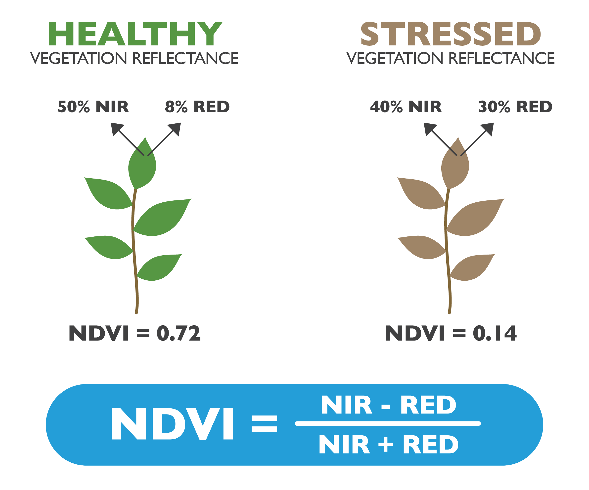
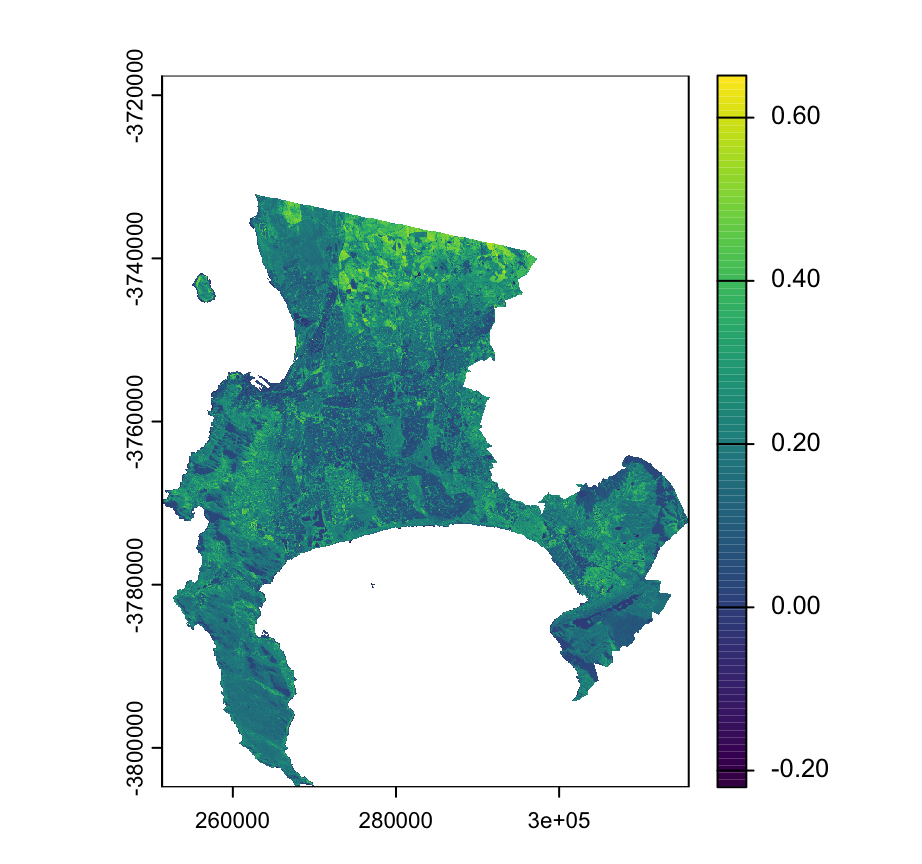
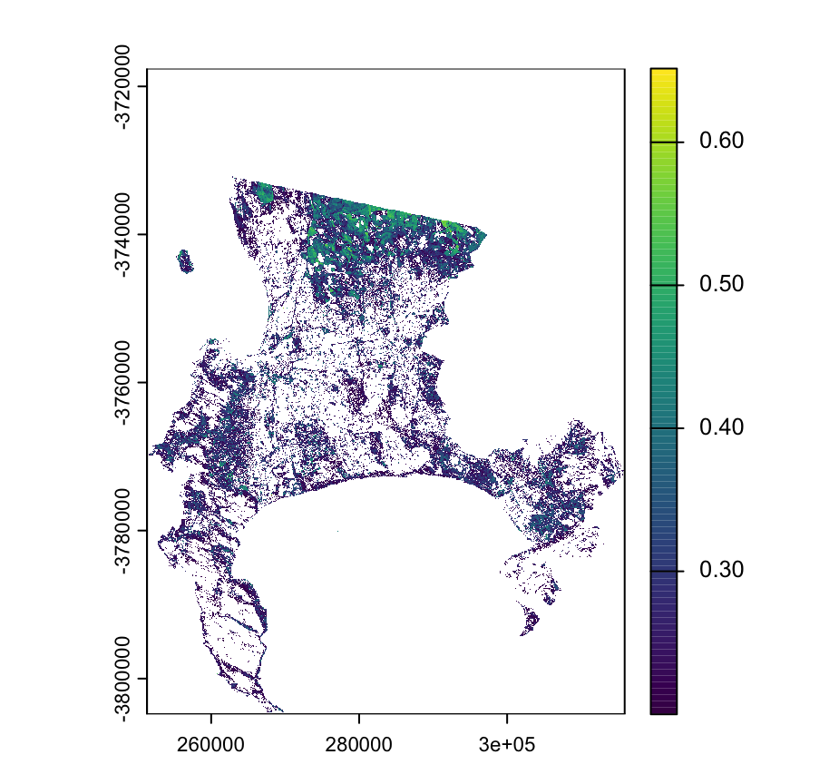
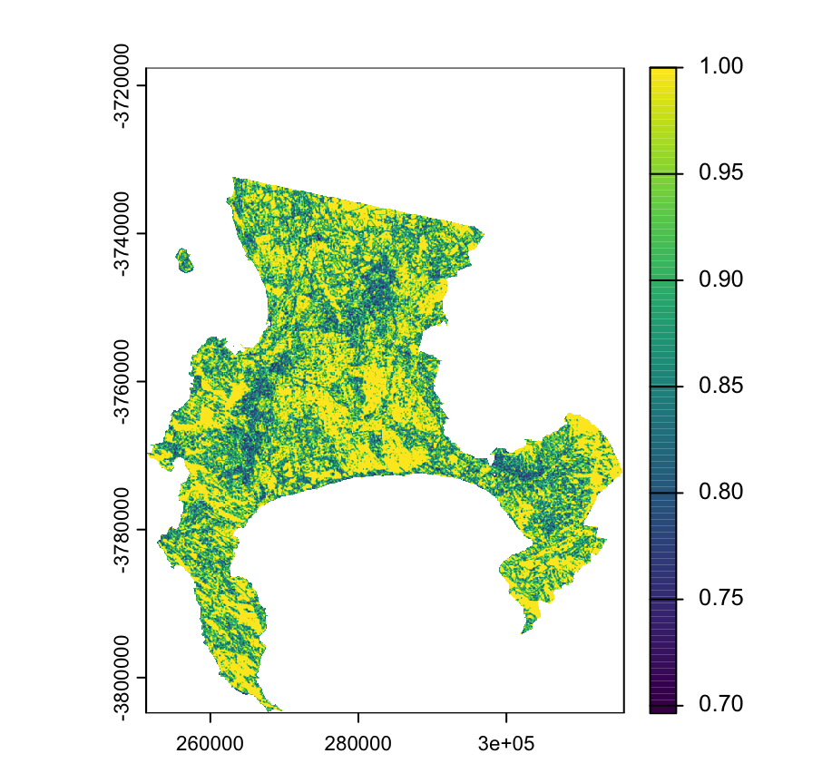
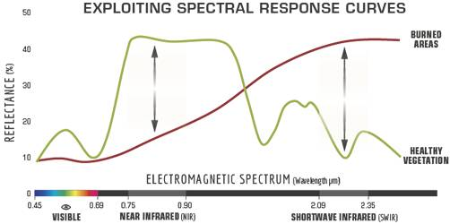

## Summary

**Corrections and enhancement** are the two main parts of EO data pre-processing. This week, I mainly focused on two enhancements: **Ratio and Texture**.

### Ratio: NDVI

Ratioing exploits the contrast between spectral bands to highlight landscape features. A classic application is the **Normalized Difference Vegetation Index (NDVI)**. This index uses the fact that healthy vegetation reflects Near-Infrared (NIR) light strongly while absorbing most Red light for photosynthesis. We could use the NDVI index to highlight areas with healthy vegetation.

{fig-align="center" width="60%"}

```{=html}
<p style="text-align: left; color: gray; font-size: 0.8em;">
  Source: <a href="https://www.agricolus.com/en/vegetation-indices-ndvi-ndmi/" style="color: gray; text-decoration: underline;">Agricolus</a>
</p>
```

As shown in picture, I plotted the NDVI distribution of City of Cape Town using Landsat imagery from July 2022 in practical.

{fig-align="center" width="90%"}

```{=html}
<p style="text-align: left; color: gray; font-size: 0.8em;">
  Normalised Difference Vegetation Index for City of Cape Town
</p>
```

We could get more clear results by pulling out certain areas where NDVI is greater than 0.2. It is important to note that July is winter in Cape Town, which is the rainy season. The bright yellow and green areas in the north are mostly farmlands. Crops like wheat grow rapidly during this time, resulting in high NDVI values.

{fig-align="center" width="90%"}

```{=html}
<p style="text-align: left; color: gray; font-size: 0.8em;">
  NDVI for City of Cape Town (only showing values above 0.2)
</p>
```

In contrast, the southern areas (like the Cape Peninsula) show lower values. This is because the native fynbos vegetation consists of woody shrubs with small leaves, which naturally reflect less light than leafy crops. Also, the steep mountains cast long shadows in winter, which can lower the NDVI readings.

### Texture

Texture measures the spatial relationship and structural complexity between a pixel and its neighbors. It quantifies **"smoothness"** (high similarity between neighbors) versus **"roughness"** (high contrast).

{fig-align="center" width="90%"}

```{=html}
<p style="text-align: left; color: gray; font-size: 0.8em;">
  Texture for City of Cape Town
</p>
```

The Cape Town map displays a speckled mix of colors rather than large solid blocks. Yellow pixels represent smooth areas (like field centers), while blue and green indicate rough edges.

::: {.callout-tip appearance="simple" icon="false"}
This fragmented texture is likely caused by the small **3x3 window size** used in the analysis. While this small window perfectly captures precise boundaries and fine details, its main limitation is picking up salt-and-pepper noise. Consequently, it is harder to identify broad, continuous zones (like whole farms) compared to using a larger window (e.g., 7x7 or 15x15).
:::

### Benefits, Limitations and Future Developments

+------------------+-------------------------------------------------------------------------------------------+---------------------------------------------------------------------------------------------+------------------------------------------------------------------------------------------+
|                  | Benefits                                                                                  | Limitations                                                                                 | Future Developments                                                                      |
+:================:+===========================================================================================+=============================================================================================+==========================================================================================+
| **Ratio (NDVI)** | 1.  It quickly assesses vegetation health using near-infrared and red light contrast.     | 1.  It easily saturates in dense forests, making high biomass differentiation difficult.    | 1.  Using hyperspectral data to create narrow-band indices for higher precision.         |
|                  |                                                                                           |                                                                                             |                                                                                          |
|                  | 2.  As a normalized ratio, it effectively minimizes illumination and topographic effects. | 2.  It is often distorted by soil background noise and deep shadows (like in Cape Town).    | 2.  Combining optical indices with radar (SAR) data to bypass shadows and clouds.        |
+------------------+-------------------------------------------------------------------------------------------+---------------------------------------------------------------------------------------------+------------------------------------------------------------------------------------------+
| **Texture**      | 1.  It adds valuable spatial context by measuring landscape smoothness and roughness.     | 1.  It is highly sensitive to window size; small windows cause salt-and-pepper noise.       | 1.  Developing adaptive window sizes that automatically adjust to target ground objects. |
|                  |                                                                                           |                                                                                             |                                                                                          |
|                  | 2.  Small window sizes (e.g., 3x3) perfectly capture fine details and precise boundaries. | 2.  Calculating complex metrics (like GLCM) across massive images is computationally heavy. | 2.  Integrating texture directly into deep learning networks for automated extraction.   |
+------------------+-------------------------------------------------------------------------------------------+---------------------------------------------------------------------------------------------+------------------------------------------------------------------------------------------+

## Application

### Ratio: NBR

In week1&2, I explored how spectral indices like NDVI and red-edge ratios are crucial for monitoring vegetation health (LAI) and mitigating Urban Heat Islands. Additionally, a key application in disaster management is the **Normalized Burn Ratio (NBR)**, which contrasts Near-Infrared (NIR) and Shortwave Infrared (SWIR) bands to identify burnt areas. High NBR values reflect healthy vegetation, while low values point to bare ground or recent burns. [This website](https://un-spider.org/advisory-support/recommended-practices/recommended-practice-burn-severity/in-detail/normalized-burn-ratio) introduces how NBR can be used to identify burn severity by comparing the difference between the pre-fire and post-fire NBR (dNBR or ∆NBR).

{fig-align="center" width="80%"}

```{=html}
<p style="text-align: left; color: gray; font-size: 0.8em;">
  Comparison of the spectral response of healthy vegetation and burned areas. Source: U.S. Forest service.
</p>
```

### Texture: Distinguishing Slums

While spectral ratios are powerful, they are limited by the "same spectrum, different object" phenomenon. Relying solely on spectral data is insufficient for complex heterogeneous environments, such as **distinguishing between formal and informal urban settlements (slums and shantytowns)**. Studies by @wang2019 have successfully employed texture measures (GLCM) to distinguish slums from formal areas. They note that slums typically exhibit different structural patterns compared to planned housing. However, they point out a major challenge: the accuracy of the results depends heavily on the window size used. This mirrors the limitations I observed in my own practical results, where an arbitrary window size might lead to noise.

## Reflection

To be honest, I found this week’s focus on enhancement much more engaging and interesting than the technical corrections process. It felt like I was finally drawing out the hidden stories in the data rather than just fixing errors. The biggest realization for me was that spectral data (ratio) isn't the whole truth. Texture analysis fascinated me because it visualized the "roughness" of the city, picking up details that NDVI missed.

However, the practical side made me realize how much my final map depended on a simple, subjective choice: the window size. It makes me slightly nervous to think about this in a real policy context: if we pick the wrong window size, we could completely misclassify a vulnerable settlement. In the future, I hope to explore more about data fusion (combining NDVI and texture), hoping that combining methods might reduce this reliance on manual trial and error.
