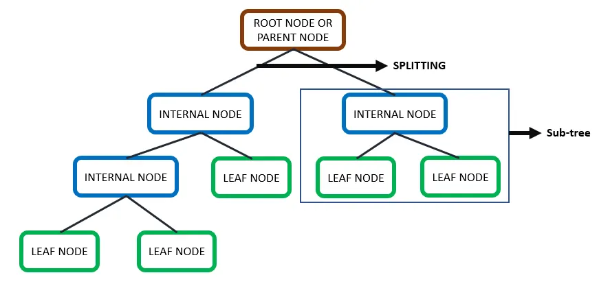
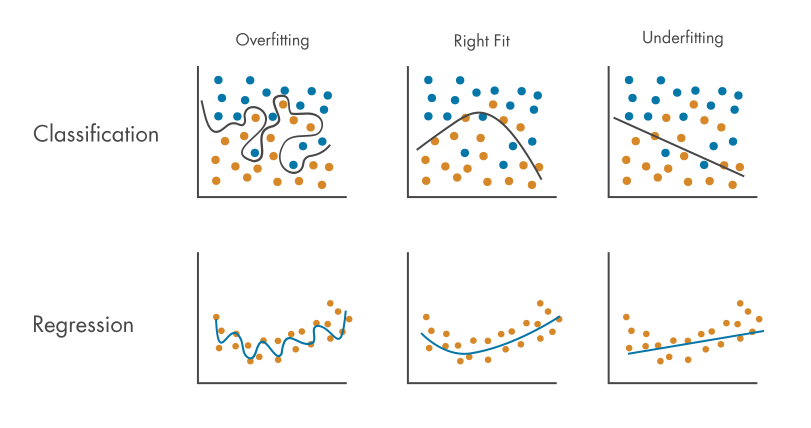
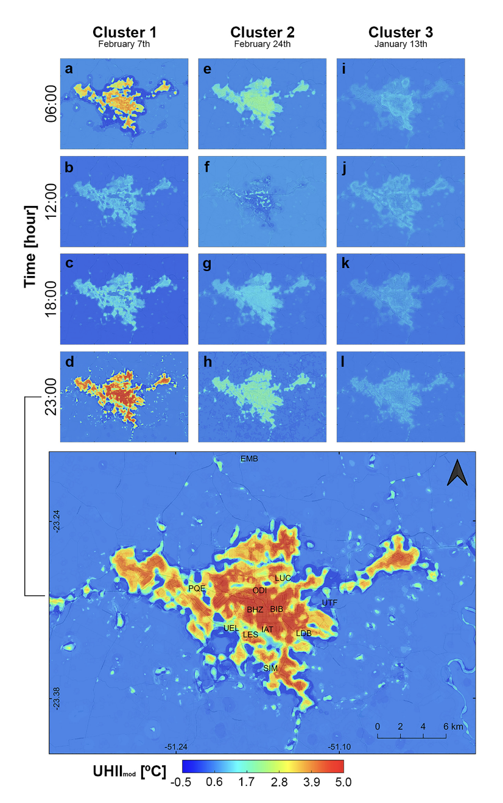

## Summary

This week we learnt about machine learning methods, from the simplest linear regression, classification and regression trees (CART), to random forest, and how they can be implemented in GEE. They are useful methods for prediction or classification with remote sensing data.

### CART

CART predicts by repeatedly splitting data into smaller, more homogeneous subsets called nodes.

{fig-align="center" width="80%"}

```{=html}
<p style="text-align: left; color: gray; font-size: 0.8em;">
  CART structure.Source: <a href="https://python.plainenglish.io/cart-classification-and-regression-trees-part-i-20edc81f8296" style="color: gray; text-decoration: underline;">Medium</a>
</p>
```

As its name suggests, CART can be used to predict both categorical (classification) and continuous (regression) values. For classification tasks, it measures how mixed a group is using *Gini Impurity*. The goal is to find splits that create the purest possible groups, and the final prediction is based on the majority vote in that final leaf. For regression tasks, it splits the data to find the *lowest Sum of Squared Residuals (SSR)*, outputting the average numerical value for that specific chunk of data.

A major challenge with CART is knowing when to stop splitting. If the tree keeps growing until every leaf only has one data point, it will memorize the training data perfectly. This is called **overfitting**, meaning the model has high variance and will perform poorly on new, unseen data. To prevent this, we can restrict the tree's growth by setting a minimum number of observations required to make a split (for example, setting the minimum to 20). Alternatively, we can use a technique called *pruning* to remove complex branches, which keeps the model simple and helps it generalize better.

{fig-align="center" width="80%"}

```{=html}
<p style="text-align: left; color: gray; font-size: 0.8em;">
  Overfitting. Source: <a href="https://www.mathworks.com/discovery/overfitting.html" style="color: gray; text-decoration: underline;">Mathworks</a>
</p>
```

Here is an example of CART classification on land use in Tianjin, China (my hometown) using Sentinel-2 data.

{fig-align="center" width="100%"}

```{=html}
<p style="text-align: left; color: gray; font-size: 0.8em;">
  CART classification in Tianjin on Sentinel 2 Imagery
</p>
```

::: {.callout-tip appearance="simple" icon="false"}
Actually, there are some missing areas in the north and west. This is likely because the original satellite images did not fully cover those parts of Tianjin. Another possible reason is that the shapefile used for clipping did not perfectly match the actual boundaries of the city.
:::

### Random Forest

Random Forest is a machine learning algorithm made up of many individual decision trees. A single decision tree can sometimes struggle to make good predictions on new, unseen data. To fix this, a Random Forest builds multiple trees using random subsets of training data, a process known as *bootstrapping*. Once all the different trees are built, they each make their own prediction, and the final output is decided by a simple majority vote. By combining the results of many trees, the final model becomes much more accurate and reliable than relying on just one.

Here are the results of a Random Forest Classifier on the same imagery of Tianjin.

{fig-align="center" width="100%"}

```{=html}
<p style="text-align: left; color: gray; font-size: 0.8em;">
  Random forest classification in Tianjin
</p>
```

### Comparison

These maps show clear differences between the two methods. The CART map creates a slightly noisy or speckled look (often called the *salt-and-pepper effect*) with more scattered, isolated pixels. This may be because CART uses a single decision tree, which can sometimes overfit the training data.

On the other hand, the Random Forest map looks cleaner and more uniform. This is because Random Forest combines many decision trees and averages their votes, which smooths out the individual errors. This highlights a major benefit of Random Forest: **it handles noise much better and creates a more reliable, generalized map compared to CART.**

## Application

In addition to LULC classifications, CART and Random Forest are also widely applied to many prediction and analysis tasks in the field of urban studies.

For example, @oukawa2022 used a Random Forest model to study the *Urban Heat Island (UHI) effect* in Londrina, Brazil. They trained the model to predict daytime and nighttime air temperatures using various predictors, including weather data, land cover, and urban geometry. I think this approach is very useful for urban planning, as it highlights specific hotspots that need more green spaces. However, because the study only used summer data, the model might not work as well in other seasons. This raises questions about the model's generalizability. Also, an $R^{2}$ score over 0.96 is extremely high, which might suggest the model is slightly overfitted.

{fig-align="center" width="80%"}

```{=html}
<p style="text-align: left; color: gray; font-size: 0.8em;">
  Predicting UHI temperatures in Londrina, Brazil using a random forest model. Source: Oukawa, Krecl, and Targino <a href="https://www.sciencedirect.com/science/article/pii/S0048969721079158?casa_token=HmZMKCZRWOUAAAAA:BQgj9WDE2F26YYPXLNJ4McM08yuiwMw5J6DFuWGkDcPBVp5NYlPk025dRvHKKDIczUyCUQ64" style="color: gray; text-decoration: underline;">(2022)</a>
</p>
```

Furthermore, researchers have widely applied Random Forest models to study urban traffic. @liu2017 built a Random Forest model which relied on general categorical variables such as weather, road conditions, and holidays to forecast congestion levels. It performed quite well, reaching an 87.5% accuracy rate. While I find this categorical approach surprisingly effective and easy to implement, it feels somewhat limited. Relying solely on broad static features might not be enough for real-world traffic management. Live GPS or vehicle count data might be integrated into future models to better capture complex urban patterns.

## Reflection

Reflecting on this week, it is really exciting to see theoretical machine learning models like CART and Random Forest put into practice. Seeing these algorithms actually map out my hometown of Tianjin makes the theory feel much more tangible. While mapping land cover is cool, I am most fascinated by how these tools can be pushed further to tackle complex urban issues like heat islands and traffic congestion.

However, reading the literature also taught me to be cautious. **A model is only as good as its training inputs.** If we rely on limited seasonal data or static variables, the models will struggle to generalize and might easily overfit. In the future, I think the real potential in urban studies lies in combining remote sensing imagery with dynamic, real-time datasets like live vehicle GPS or mobile phone data. This could shift our focus from just observing a city's physical layout to truly understanding its daily pulse, helping urban planners make smarter, more responsive decisions.
