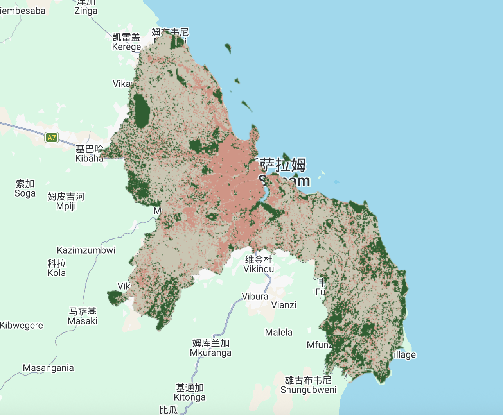
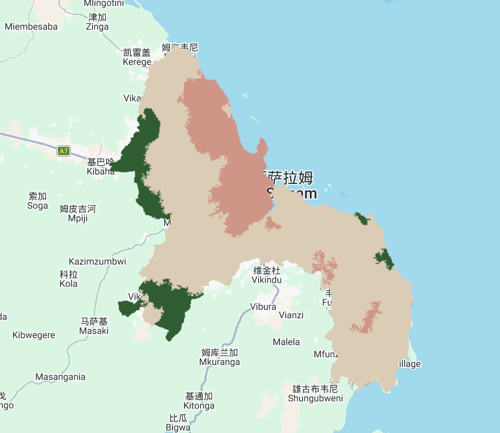

## Summary

### Sub Pixel Analysis

Sub-pixel analysis is a technique used when a single image pixel contains multiple land cover types. Instead of classifying the whole pixel as just one category, this method calculates the exact proportion of each land cover present inside it. It works by assuming the total reflectance of a pixel is the linear sum of *end members*. End members are spectrally pure examples of a specific material, such as pure water or vegetation. By comparing the pixel's actual reflectance values to these ideal end members, the algorithm determines the fraction of each material.

{fig-align="center" width="80%"}

```{=html}
<p style="text-align: left; color: gray; font-size: 0.8em;">
  Sub-pixel analysis map in Dar es Salaam.
</p>
```

### Object Based Image Analysis (OBIA)

OBIA is almost the inverse of sub-pixel analysis: instead of trying to determine what the landcover class within each pixel might be, it groups pixels together. It does this by identifying homogeneous areas and clustering them into shapes called *superpixels* using algorithms like SLIC or SNIC. Once this grid of grouped pixels is formed, it then assigned landcover classes using tools like CART. This approach is highly effective because it recognizes that a single raster cell rarely represents a complete, real-world object on the ground.

{fig-align="center" width="80%"}

```{=html}
<p style="text-align: left; color: gray; font-size: 0.8em;">
  OBIA analysis map in Dar es Salaam.
</p>
```

### Limitations, Benefits and Future Developments

+------------------------+--------------------------------------------------------------------------------------------------------------------------------------------+-------------------------------------------------------------------------------------------------------------------------------+-------------------------------------------------------------------------------------------------------------------------------------------------------------------------------+
|                        | Benefits                                                                                                                                   | Limitations                                                                                                                   | Future Development                                                                                                                                                            |
+:======================:+============================================================================================================================================+===============================================================================================================================+===============================================================================================================================================================================+
| **Sub Pixel Analysis** | 1.  It surpasses physical resolution limits to accurately calculate the exact proportions of mixed land covers within a single pixel.      | 1.  This method heavily depends on the quality and purity of the extracted end members.                                       | Future development focuses on building larger, automated spectral libraries and using machine learning to handle complex non-linear spectral mixing.                          |
|                        |                                                                                                                                            |                                                                                                                               |                                                                                                                                                                               |
|                        | 2.  It provides a cost-effective approach by utilizing freely available, medium-resolution satellite imagery [@saba2023].                  | 2.  Utilizing multi-endmember models like MESMA significantly increases the overall computational cost.                       |                                                                                                                                                                               |
+------------------------+--------------------------------------------------------------------------------------------------------------------------------------------+-------------------------------------------------------------------------------------------------------------------------------+-------------------------------------------------------------------------------------------------------------------------------------------------------------------------------+
| **OBIA**               | 1.  It achieves higher accuracy and avoids the salt-and-pepper effect by combining spectral, spatial, and geometric features [@saba2023a]. | 1.  Setting clustering parameters, such as superpixel count and feature balance, often demands subjective manual adjustments. | Future trends involve developing algorithms for automatic superpixel parameter selection and integrating them with deep learning networks like CNNs for smarter segmentation. |
|                        |                                                                                                                                            |                                                                                                                               |                                                                                                                                                                               |
|                        | 2.  The resulting maps offer high spatial consistency that closely matches human visual interpretation.                                    | 2.  Basic algorithms sometimes ignore connectivity, creating overly fragmented, tiny patches.                                 |                                                                                                                                                                               |
+------------------------+--------------------------------------------------------------------------------------------------------------------------------------------+-------------------------------------------------------------------------------------------------------------------------------+-------------------------------------------------------------------------------------------------------------------------------------------------------------------------------+

### Accuracy Assessment and Spatial Autocorrelation

Evaluating a model's accuracy is an essential step in image classification. We usually use a confusion matrix to calculate metrics like *Producer's Accuracy, User's Accuracy, and F1-score.*

However, in remote sensing, pixels close to each other are often very similar. This is called spatial autocorrelation. Because of this, traditional random cross-validation can make the model's accuracy look better than it actually is. To solve this problem, we must use *spatial cross-validation* to physically separate the training and testing data.

## Application

Advanced methods like sub-pixel analysis and OBIA are widely used in land use and land cover (LULC) mapping. A good example is regional crop area estimation. @verbeiren2008 used sub-pixel analysis to map crop areas in Belgium with low-resolution satellite images. Instead of giving one label to a large 1-km pixel, they calculated the exact percentage of different crops mixed inside it. However, a major limitation of this method is spatial uncertainty. While it finds the total crop area, we still do not know the exact locations of these crops within the pixel. Future studies should fix this problem by using better medium-resolution data, like 250m MODIS, or by creating new algorithms to map these fractions into real physical boundaries.

Beyond traditional land use mapping, OBIA is widely applied in fields like precision agriculture, disaster damage assessment, and urban and infrastructure management. For disaster assessment, @zheng2021a developed a new model combining OBIA with deep learning to evaluate building damage after the Beirut port explosion. Pure pixel-level deep learning often gives mixed results, such as assigning different damage levels to the same building. OBIA solves this by treating the whole building as a single object, ensuring consistent results. This method perfectly shows the future trend of combining OBIA with deep learning. However, a major limitation in real-world applications is that optical remote sensing is very sensitive to bad weather. Thick clouds can easily hide buildings, making the model ineffective. To overcome this challenge, future research needs to integrate multi-modal data, such as radar, or use multi-temporal imagery to avoid cloud cover.

## Reflection

Reflecting on this week, learning about sub-pixel analysis and OBIA was very inspiring. We are no longer just giving one label to a square pixel. Instead, we can find mixed materials inside a pixel or group pixels into real-world objects. Reading how @zheng2021b combined OBIA with deep learning gave me a great idea. Although deep learning seems hard, I can definitely see myself using OBIA to map complex cities in the future.

Also, learning about spatial autocorrelation was a big shock. It is scary to realize that a model with high accuracy might just be cheating because training and testing pixels are too close! Understanding spatial cross-validation completely changed how I look at spatial data. It makes me question the basic machine learning models I used before. In the future, I will always use these better validation methods to ensure my results are truly reliable, rather than just looking good on paper.
