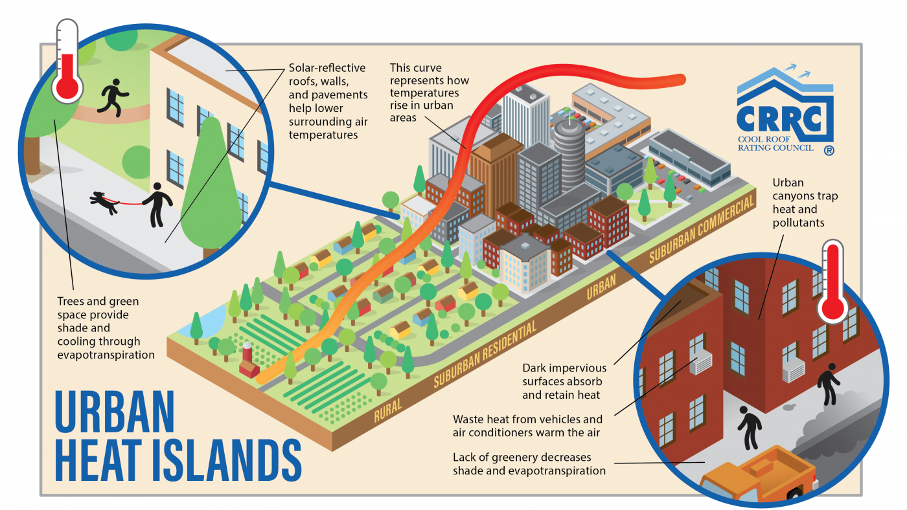
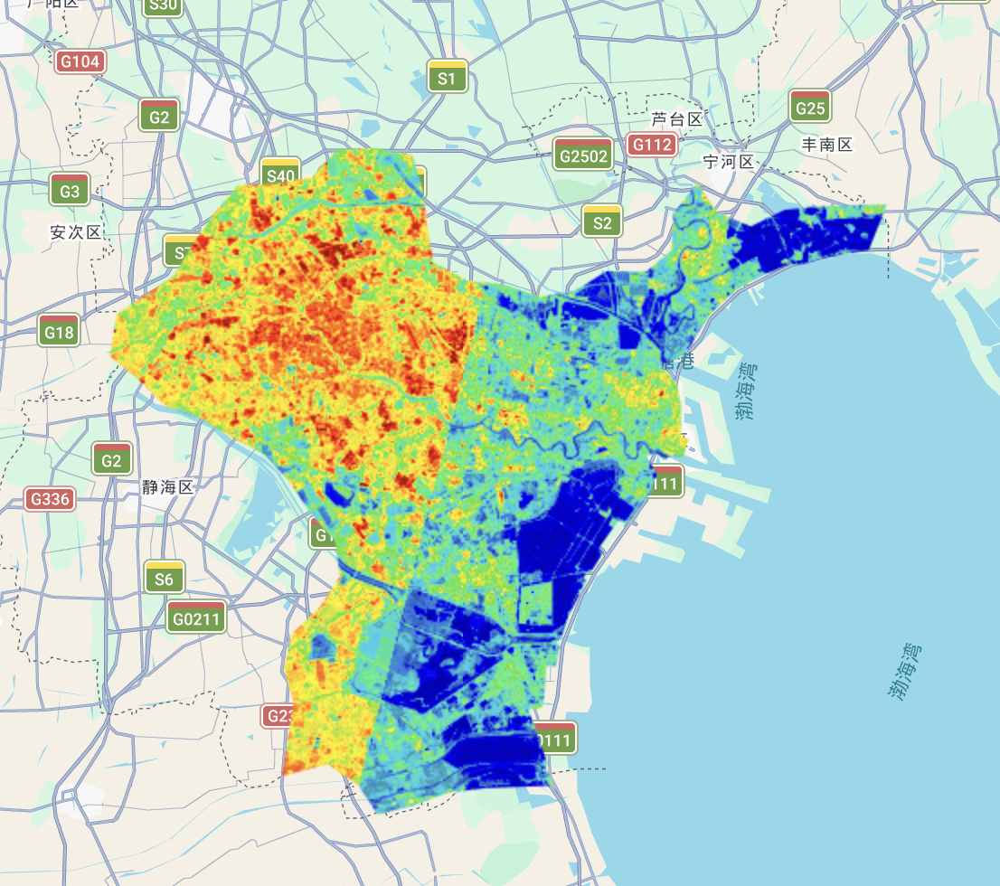
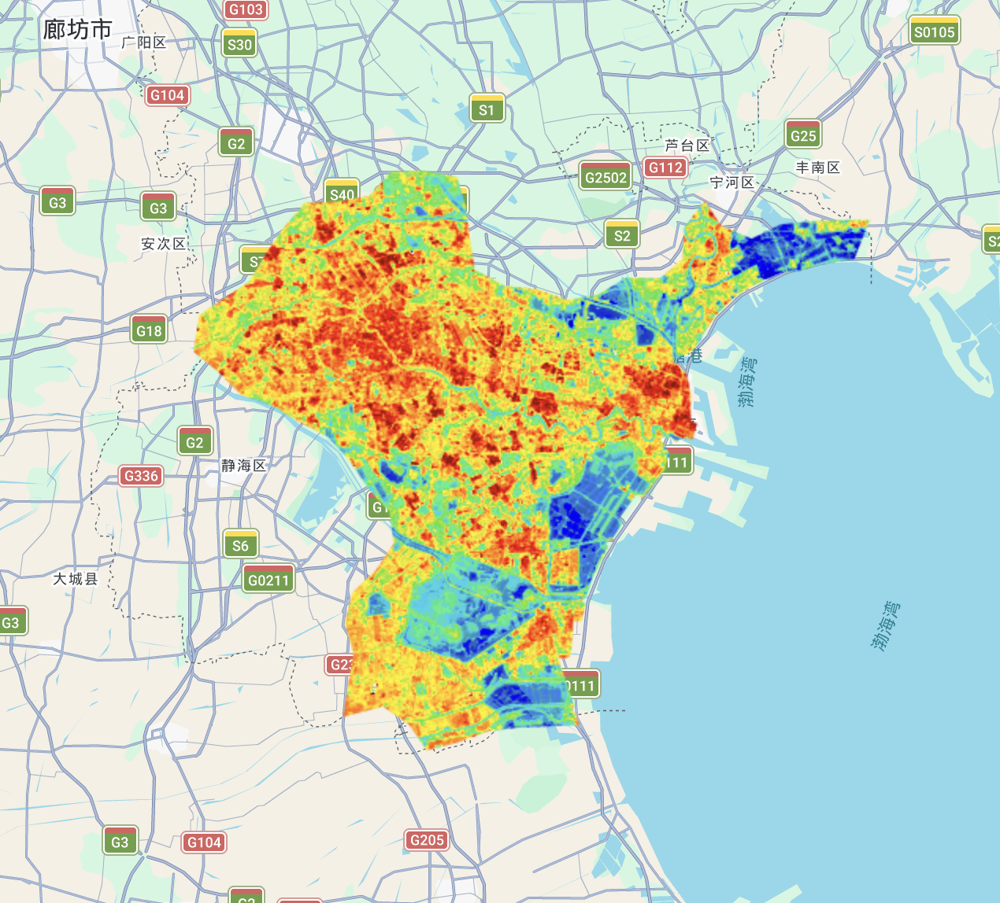
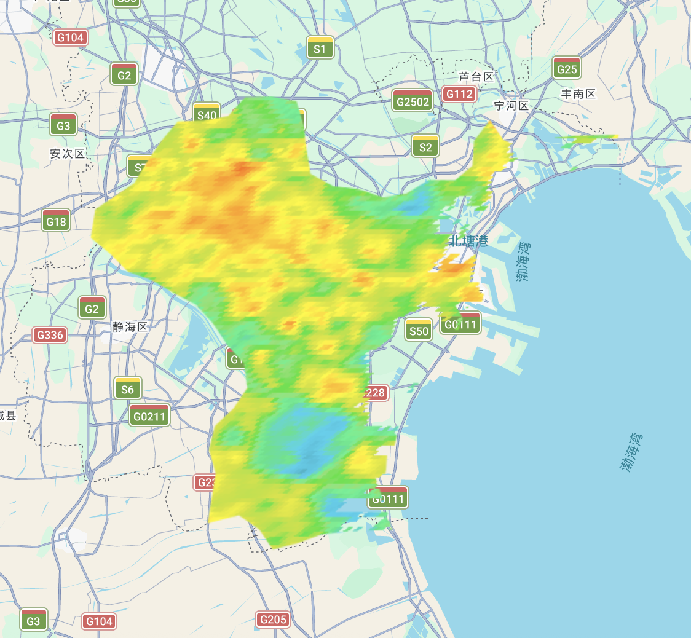
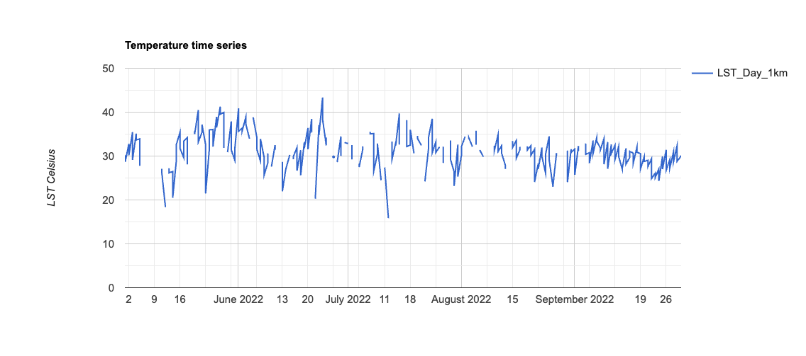

## Summary

This week's lecture focused on the intersection of urban temperature and policy, specifically how we can use remote sensing to understand and address rising heat in our cities.

### Urban Heat Island

The *Urban Heat Island (UHI)* effect occurs when cities experience significantly higher temperatures than surrounding rural areas. As I explored in [week4](https://mixedmint.github.io/learning_diary/week4&5.html) analysis of Singapore, addressing UHI is vital for urban planning to protect public health and infrastructure.

This warming is driven by several interacting factors in the built environment:

-   **Heat absorption:** Dark surfaces, like asphalt roads and rooftops, easily absorb and retain solar heat.

-   **Reduced cooling:** A lack of vegetation means less shade and less evapotranspiration to naturally cool the air.

-   **Trapped heat:** Tall buildings physically trap heat in the streets, keeping urban cores warmer, especially at night.

-   **Human activity:** Waste heat from vehicles, air conditioners, and factories generates additional warmth.

{fig-align="center" width="90%"}

```{=html}
<p style="text-align: left; color: gray; font-size: 0.8em;">
  Urban heat island. Source: <a href="https://coolroofs.org/resources/urban-heat-island-mitigation" style="color: gray; text-decoration: underline;">CRCC</a>
</p>
```

### Exploring Urban Temperature

In practical, I used Landsat and MODIS data to conduct a analysis of the Land Surface Temperature (LST) in Tianjin.

{fig-align="center" width="80%"}

```{=html}
<p style="text-align: left; color: gray; font-size: 0.8em;">
  Mean Landsat temperature for Tianjin in 2022. 
</p>
```

The split effect happened because Landsat scans the Earth in vertical strips. My original code strictly removed any image with over 1% clouds. As a result, one side of the map used hot summer images, while the cloudy side was left with cooler autumn images. Averaging these different seasons created a sharp line.

To fix this, I asked Gemini and increased the cloud limit to 50% and applied a pixel-level cloud mask. Instead of deleting entire images, this function only removes specific cloudy pixels. This ensures consistent summer data across the whole area, creating a smooth temperature map.

{fig-align="center" width="80%"}

```{=html}
<p style="text-align: left; color: gray; font-size: 0.8em;">
  Landsat temperature map after processing. 
</p>
```

{fig-align="center" width="80%"}

```{=html}
<p style="text-align: left; color: gray; font-size: 0.8em;">
  Mean MODIS temperature for Tianjin in 2022. 
</p>
```

{fig-align="center" width="90%"}

```{=html}
<p style="text-align: left; color: gray; font-size: 0.8em;">
  Time series of temperature in Tianjin. 
</p>
```

### Comparison of Datasets (Landsat vs MODIS)

|   | Benefits | Limitations | Future Development |
|:--:|----|----|----|
| **Landsat** | It provides high spatial detail, allowing us to see clear temperature differences between specific streets and parks. | It only captures images every 16 days, so clouds can easily block the data for a long time. | Researchers are using algorithms to combine MODIS's daily updates with Landsat's clear details to create a perfect daily map. |
| **MODIS** | It collects data every day, making it very easy to track long-term trends and filter out cloudy days. | The spatial resolution is very low (1km), which blurs the city into large blocks and hides local details. | AI models are being used to sharpen the low-resolution MODIS data into high-resolution temperature maps. |

## Applications

To understand how remote sensing informs urban climate adaptation, I reviewed @cotlier2022's assessment of the 2021 Western North America heatwave. They applied MODIS and Landsat-8 data to extract Land Surface Temperature and map the Surface Urban Heat Island (SUHI) effect. By combining these satellite sources, both the daily progression of the disaster and its specific impacts on local neighborhoods can be captured. However, their study relies on Land Surface Temperature, which measures surface heat rather than the ambient air temperature humans actually experience, potentially misrepresenting true public health risks.

Building directly on the need to translate surface heat into human-experienced temperatures, @schaefer2021 provide a compelling micro-level solution. They combined high-resolution remote sensing data (such as Sentinel-2) with micro-climate simulations and pedestrian surveys. Instead of relying solely on macroscopic LST, this approach models the Physiologically Equivalent Temperature (PET) to evaluate the actual thermal comfort and air quality experienced by people on specific streets. This successfully addresses the human health gap identified earlier. However, a critical limitation of such detailed micro-climate modeling is its massive computational cost, making it difficult to scale across entire metropolitan areas. To overcome this, future literature should explore integrating machine learning algorithms to accelerate these simulations. This would allow planners to efficiently scale human-centric thermal models city-wide, balancing local pedestrian insights with broader urban policy needs.

## Reflection

Reflecting on this week, what struck me most was the gap between raw satellite data and human reality. When my Landsat code initially produced a fractured map due to cloud cover, it was a frustrating but eye-opening lesson. I realized that remote sensing is not just about downloading images. It needs careful processing, like the pixel-level cloud masking I applied, to show the true picture.

Beyond the technical skills, I find the difference between satellite-measured surface heat and actual human comfort deeply fascinating. Satellites can easily spot a hot asphalt road, but they don't feel the heat of a pedestrian waiting at an unshaded bus stop. Moving forward, I want to explore overlaying these thermal maps with socioeconomic datasets. If we can identify where the hottest urban areas intersect with the most vulnerable communities, we can use remote sensing not just to observe the Urban Heat Island, but to guide environmental justice, like deciding exactly which neighborhoods need new street trees the most.
